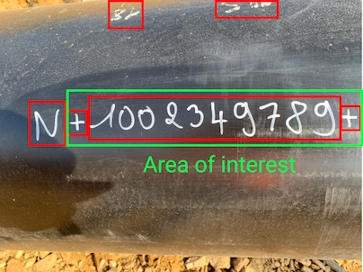

Quickly recognizing the serial number of a pipeline is necessary for the smooth running of the construction site. It is useful in many construction phases. Recognition with a camera is a good compromise. The serial number is written directly on the pipe with a "metal writing". However, it is necessary that the writing and the picture taking are done rigorously.

Design without sleeve: '+ SERIAL NUMBER +'.

## Problematic

An application is operated from a central database and tablets operated in the field (site).

The problem is therefore based on the need to read the number of the tube or weld which is the reference of the parameters, without losing time, without possibility of error.

For that, the reading of the barcodes was used from the tablets, initially, for the research of the tube number.

1. This operation involves affixing a barcode label to the ends of each tube. This operation involves:
    - The printing of the labels
    - The transmission of the labels to the site
    - The application of the labels

2. It turns out that the thickness of the label can compromise a visual control operation of the tube coating and the passage of the electric broom intended to check the cathodic protection of the tube.

*How to identify a tube number in the most optimal way?*

## Solution

A model detecting an area of interest on a tube coupled with an OCR solution allows the rapid identification of a tube number. 

This model was trained on YOLOv7 : https://github.com/WongKinYiu/yolov7

## Training

## Results

